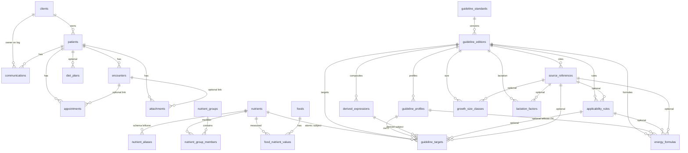

# Project: VetDietDerm

## Project Description

VetDietDerm is a veterinary clinical workbench for specialists who manage patients, consultations, and follow-up. The first focus segments are veterinary dermatologists and nutritionists. The product does not replace clinical judgment: calculators and guidance must show sources, versions, and leave the final decision to the clinician.

## Target Users

- Private-practice veterinary nutritionists and dermatologists
- Small specialty clinics and cabinets
- Assistants and admins who schedule visits and owner communications (later CRM depth)

Primary remaining Core work is Clinical CRM Pivot (#5). The nutrition workbench is closed through cycle #6.

## Business Model

B2B software for private specialists and small clinics (assumption from current product direction). Monetization details are not fixed.

## Product Vision

Become the primary work window across the treatment cycle: client and patient → scheduled encounter → structured clinical record → reproducible calculations and diet plans → follow-up. Dermatology and nutrition are specialization packs on a shared clinical core, not separate apps.

Near-term product emphasis: a trustworthy FEDIAF 2025 dietetics assistant on a split stack (Next.js UI, FastAPI API, PostgreSQL). Guideline and catalog data are versioned in the database. The application does not use JSON files or generated TypeScript guideline modules at runtime.

The nutrition workbench lets the clinician start from a real Patient (or a manual profile), browse the Food catalog as a nutrient table, and assess a ration against FEDIAF for dogs and cats. Energy need and nutrient norms are independent clinical questions, joined only by animal-context compatibility — not by an application-owned `energy_formula → nutrient_profile` pair. The clinician works a scenario (animal, energy method, nutrient standard, ration), not internal database objects. Disease-specific therapeutic nutrient profiles remain a later specialization, not a hidden switch that blanks the current analysis.

The rebuild laid a foundation for CRM and specialty packs: separate Client and Patient, modular API bounded contexts, one FastAPI process that can be split later. Clinical encounters, templates, attachments, appointments, and communications now sit on that core.

## Current Functionality

Shipped runtime is the **split stack**: Next.js UI in `frontend/`, one FastAPI process in `apps/api/`, PostgreSQL at `127.0.0.1:15432`, instance password. Prisma and Next.js Route Handlers are not in runtime.

- Client and Patient as separate entities; search, create, edit; patient card fields include allergies, chronic conditions, and feeding notes
- Encounters on the patient card and `/encounter`: specialty (dermatology / nutrition / general), SOAP, structured anamnesis, VAS 1–10, statuses draft / in progress / completed
- Encounter templates for anamnesis, exam, and plan; scopes `standard` (read-only), `clinic`, and `doctor`
- Dermatology gallery: lesion photos and PDFs stored on disk (`ATTACHMENT_DIR`), metadata and VAS in PostgreSQL, optional link to an encounter
- Schedule (`/schedule`): day list of appointments with visit type and status, create / reschedule / cancel, deep-link to the patient card
- Communication log on the patient card (channel, direction, follow-up time)
- Nutrition workspace (`/nutrition`) tabs: **Рацион и анализ**, **Недавние планы**, **Каталог Foods**
- Patient picker on the ration tab: search by animal or owner, or stay on «Без пациента · ручной профиль»; `?patientId=` from the patient card still prefills; Patient remains optional on save
- Food catalog: category/subcategory panel (eight import buckets; subcategories mostly brands), paged as-fed nutrient matrix by SPEC group, server sorting, 50-row load-more, name search; empty until a category or search is set
- Ration builder; honest FEDIAF 2025 assessment from PostgreSQL guidelines; replace-on-save Diet Plan snapshot
- Dog/cat assessments resolve `energy_formula_code` and `nutrient_profile_code` on the server from the animal card; exact profile/formula pairing is not a 422. `therapeutic_goal` remains an ignored compatibility field
- Adult standards use imported MER profiles automatically: dog low activity → MER95, other adult dog → MER110; cat indoor/low-activity or neutered → MER75, active adult cat → MER100. Table VII-11 remains stored as reference data
- Energy is stored as formula reference kcal and adjusted working kcal. Point formulas use the calculated point; range formulas use the midpoint; a percentage adjustment is applied afterward. RER × factor is a secondary cross-check
- Current, target, and expected mature weights are distinct; dog size class is derived server-side from expected mature weight with no UI override
- Relevant input edits mark the visible assessment stale; the response carries `input_hash`; late responses cannot restore an older calculation
- Legacy Diet Plans render as stored without remap or auto-recompute; current-version recalc is an explicit clinician action
- Food rows have no species compatibility; ration search does not filter cat-only commercial foods away from a dog patient
- Russian UI, theme toggle, instance lock screen

Not shipped: Food `species_compatibility` (dropped from cycle #6), users/roles, owner share portal, knowledge/AI handouts, drug checker, English UI, Prisma data migration, S3, dose/fluids calculators.

## Product Cycle Roadmap

| # | Status | Stage | Cycle | Product Outcome | PRD / Issues |
| --- | --- | --- | --- | --- | --- |
| 1 | ✅ Done | Core | FEDIAF Stronger | Nutritionist can run a confirmed FEDIAF 2025 happy path on the prototype (JSON SoT, stage confirm, therapeutic gate, Diet Plan `fediafMeta`); NRC/CSV runtime removed. Quality bar was not shipped. | [PRD](prd/2026-08-27_fediaf-stronger_prd.md) · [issues](issues/fediaf-stronger/) |
| 2 | ❌ Cancelled | Core | FEDIAF Relational Assessment | Trustworthy Postgres-backed ration analysis on the Next/Prisma prototype. Cancelled: same clinical outcome is delivered on a new stack in cycle 3; in-place Prisma refactor was rejected. | [PRD](prd/2026-08-28_fediaf-relational-assessment_prd.md) |
| 3 | ✅ Done | Core | Split-Stack Nutrition | Nutritionist uses a rebuilt workbench (Next.js UI + one FastAPI process + existing PostgreSQL): Client/Patient, Food catalog, ration, honest FEDIAF 2025 assessment, reproducible saved plan. Legacy prototype modules left runtime. Therapeutic-goal gate from this cycle was later removed in #4. | [PRD](prd/2026-08-28_split-stack-nutrition_prd.md) · [issues](issues/split-stack-nutrition/) |
| 4 | ✅ Done | Core | Nutrition Workbench Polish | Nutritionist picks a Patient on `/nutrition`, browses Foods as a category-filtered nutrient table, and always gets a FEDIAF comparison after confirm — no therapeutic-goal switch. Confirmed profile and MER formula were strictly paired until #6. | [PRD](prd/2026-08-29_nutrition-workbench-polish_prd.md) · [issues](issues/nutrition-workbench-polish/) |
| 5 | 🚧 In Progress | Core | Clinical CRM Pivot | Client/Patient/Encounter workspace with schedule, attachments, communications, and encounter templates on the split stack. Users/roles and encounter-stored calculations are still later. | — |
| 6 | ✅ Done | Core | Nutrition Context Split | Energy formulas and nutrient profiles remain independent; the server resolves both from the animal card, adult verdicts use imported MER95/110 and MER75/100 profiles, and stale results cannot look valid. | [PRD](prd/2026-08-29_nutrition-context-split_prd.md) |
| 7 | ⬜ Planned | Pro | Specialty Depth | Stronger derm/nutrition encounter templates, follow-up CRM, additional clinical calculators (dose, fluids), and disease-specific therapeutic nutrient profiles if still wanted | — |
| 8 | ⬜ Planned | Platform | Pilot Hardening | Audit, backups depth, medical-data protections, and multi-user clinic readiness on VPS | — |

## Product Architecture

- **Web:** Next.js + TypeScript + Tailwind in `frontend/` — UI only. No Next.js Route Handlers as the product backend; no Prisma in the rebuilt runtime. Clinical calculations are not duplicated in React.
- **API:** one FastAPI process (Pydantic contracts) with internal bounded contexts (`patients`, `encounters`, `encounter_templates`, `attachments`, `appointments`, `communications`, `catalog`, `guidelines`, `assessments`). Module boundaries are the foundation for later extraction; multiple API processes remain deferred.
- **Data:** existing PostgreSQL at `127.0.0.1:15432` (local and the already-provisioned VPS instance). No Vercel, no Neon. No Docker Compose / orchestration as a cycle deliverable.
- **Access:** single instance password (not per-user roles).
- **Core entities:** Client, Patient, Encounter, EncounterTemplate, Appointment, Attachment, Communication, Food, Nutrient, FEDIAF guideline edition, Diet Plan. Physical tables, keys, JSONB payloads, and import formats are in [Data](#data).
- **Nutrition analysis model:** Animal Context lets the server independently resolve an Energy Formula and Nutrient Profile. Compatibility is species + physiological context + required fields — not `energy_formula.profile_id`. Adult verdicts use imported MER95/110 and MER75/100 concentration profiles; growth and reproduction keep their published life-stage profiles. Table VII-11 remains available as reference data but is not auto-selected for adults.
- **Later entities:** User/Role, signed encounter, S3 object store, specialty calculators. They must attach to Client/Patient without collapsing owner back into Patient.
- Disease-specific therapeutic profiles are not a product mode. Species other than dog/cat still skip normative comparison.

## Data

Operational source of truth is PostgreSQL (`127.0.0.1:15432`). Schema is Alembic through `0017_me_kcal_per_100g`. Primary keys are UUID (UUIDv6). Timestamps are `timestamptz`. Nutrient inventory and assessment honesty rules live in `docs/Nutrient.md`; this chapter is the table, relationship, and format map.

No User/Role tables. Assessments are not stored as rows: the engine writes one JSON snapshot onto `diet_plans` at save. Lesion binaries live on disk; PostgreSQL keeps metadata only.

### Relationship map

`encounter_templates` has no foreign keys.

### Foreign keys

| From | Column | To | On delete | Cardinality |
| --- | --- | --- | --- | --- |
| `patients` | `client_uuid` | `clients.uuid` | RESTRICT | many patients → one client |
| `encounters` | `patient_uuid` | `patients.uuid` | CASCADE | required |
| `appointments` | `patient_uuid` | `patients.uuid` | CASCADE | required |
| `appointments` | `encounter_uuid` | `encounters.uuid` | SET NULL | optional |
| `attachments` | `patient_uuid` | `patients.uuid` | CASCADE | required |
| `attachments` | `encounter_uuid` | `encounters.uuid` | SET NULL | optional |
| `communications` | `patient_uuid` | `patients.uuid` | CASCADE | required |
| `communications` | `client_uuid` | `clients.uuid` | RESTRICT | required (owner of the patient) |
| `diet_plans` | `patient_uuid` | `patients.uuid` | SET NULL | optional; plan may be saved without a patient |
| `food_nutrient_values` | `food_uuid` | `foods.uuid` | CASCADE | many values → one food |
| `food_nutrient_values` | `nutrient_uuid` | `nutrients.uuid` | RESTRICT | many values → one nutrient |
| `nutrient_group_members` | `group_uuid` | `nutrient_groups.uuid` | CASCADE | composite PK |
| `nutrient_group_members` | `nutrient_uuid` | `nutrients.uuid` | CASCADE | composite PK |
| `nutrient_aliases` | `nutrient_uuid` | `nutrients.uuid` | CASCADE | leftover table; no ORM model |
| `guideline_editions` | `standard_uuid` | `guideline_standards.uuid` | RESTRICT | many editions → one standard |
| `guideline_profiles` | `edition_uuid` | `guideline_editions.uuid` | CASCADE | |
| `source_references` | `edition_uuid` | `guideline_editions.uuid` | CASCADE | |
| `applicability_rules` | `edition_uuid` | `guideline_editions.uuid` | CASCADE | |
| `applicability_rules` | `source_reference_uuid` | `source_references.uuid` | SET NULL | optional |
| `derived_expressions` | `edition_uuid` | `guideline_editions.uuid` | CASCADE | |
| `energy_formulas` | `edition_uuid` | `guideline_editions.uuid` | CASCADE | |
| `energy_formulas` | `profile_uuid` | `guideline_profiles.uuid` | RESTRICT | **nullable leftover**; not an application pairing invariant |
| `energy_formulas` | `applicability_rule_uuid` | `applicability_rules.uuid` | SET NULL | optional |
| `energy_formulas` | `source_reference_uuid` | `source_references.uuid` | SET NULL | optional |
| `guideline_targets` | `edition_uuid` | `guideline_editions.uuid` | CASCADE | |
| `guideline_targets` | `profile_uuid` | `guideline_profiles.uuid` | CASCADE | |
| `guideline_targets` | `nutrient_uuid` | `nutrients.uuid` | RESTRICT | XOR with `derived_expression_uuid` |
| `guideline_targets` | `derived_expression_uuid` | `derived_expressions.uuid` | RESTRICT | XOR with `nutrient_uuid` |
| `guideline_targets` | `applicability_rule_uuid` | `applicability_rules.uuid` | SET NULL | optional |
| `guideline_targets` | `source_reference_uuid` | `source_references.uuid` | SET NULL | optional |
| `growth_size_classes` | `edition_uuid` | `guideline_editions.uuid` | CASCADE | |
| `growth_size_classes` | `source_reference_uuid` | `source_references.uuid` | SET NULL | optional |
| `lactation_factors` | `edition_uuid` | `guideline_editions.uuid` | CASCADE | |
| `lactation_factors` | `source_reference_uuid` | `source_references.uuid` | SET NULL | optional |

Uniqueness that matters at runtime: one **published** edition per `guideline_standards` row (`uq_guideline_editions_one_published`); `food_nutrient_values` identity `(food_uuid, nutrient_uuid, basis, source_uuid)`; profile/formula/rule/expression codes unique per edition.

`food_nutrient_values.source_uuid` is an optional UUID with **no** `Source` table.

### Clinical CRM

| Table | Role | Notable columns / formats |
| --- | --- | --- |
| `clients` | Owner | `name`, optional `email`, `phone` |
| `patients` | Animal | `species` `dog` \| `cat` \| `other`; `body_weight_kg`, `expected_adult_weight_kg` (numeric); `birth_date`; `life_stage`, `activity` (free strings); `neutered` / `pregnant` / `lactating`; `lactation_week`, `litter_size`; `bcs` 1–9; `allergies` and `chronic_conditions` JSONB `string[]`; `feeding_notes` |
| `encounters` | SOAP visit | `specialty` `dermatology` \| `nutrition` \| `general`; `type` `appointment` \| `note` \| `diagnostic` \| `treatment`; `status` `draft` \| `in_progress` \| `completed`; SOAP text; `anamnesis_data` JSONB `{ specialty, answers, free_text }`; `diagnoses` JSONB `string[]`; `prescriptions` JSONB `{ name, dosage, frequency, duration, instructions }[]`; `vas_score`; `occurred_at` |
| `encounter_templates` | Insert snippets | `scope` `standard` \| `clinic` \| `doctor`; `section` `anamnesis` \| `exam` \| `plan`; `specialty`; `title`, `body`; optional `doctor_name`. `standard` is read-only in product |
| `appointments` | Schedule | `starts_at`, `duration_min`; `visit_type` `consultation` \| `recheck` \| `procedure` \| `telemedicine`; `status` `scheduled` \| `completed` \| `cancelled` \| `no_show`; optional `encounter_uuid` |
| `attachments` | Gallery metadata | `kind` `lesion_photo` \| `document`; `caption`, `body_region`, `vas_score`; `content_type`, `byte_size`; `storage_key` (path under `ATTACHMENT_DIR`, not the bytes) |
| `communications` | Owner log | `channel` `phone` \| `email` \| `text` \| `video` \| `in_person`; `direction` `inbound` \| `outbound`; `subject`, `body`; `occurred_at`, optional `follow_up_at` |

### Food catalog

| Table | Role | Notable columns / formats |
| --- | --- | --- |
| `nutrients` | Canonical 51 atomic codes (seed `0003_food_catalog`) | `code` unique; `category` `main` \| `mineral` \| `vitamin` \| `amino_acid` \| `fatty_acid`; `base_unit`; `sort_order`; `is_active`. `ME` unit is `kcal/100g` after `0017` |
| `foods` | Catalog row | `type` `commercial` \| `ingredient` \| `supplement`; `feed_form` `dry` \| `wet` \| `unknown`; browse keys `category` / `subcategory` (import `type` / `subcat`) |
| `food_nutrient_values` | Measured values | `value` numeric nullable (`NULL` ≠ 0); `basis` `per_100g_as_fed` \| `per_100g_dm` \| `per_1000_kcal` \| `per_mj` (preferred store: `per_100g_as_fed`); `value_status` `measured` \| `calculated` \| `estimated` \| `trace` \| `not_detected` \| `unknown`; optional `source_uuid` |
| `nutrient_groups` | Derived-ratio groups | Seeded `OMEGA_3` (`ALA`, `EPA`, `DHA`), `OMEGA_6` (`LA`, `AA`) |
| `nutrient_group_members` | Group membership | Composite PK `(group_uuid, nutrient_uuid)` |
| `nutrient_aliases` | Unused leftover | Recreated in `0010`; namespaces `fediaf_legacy` \| `product`; not mapped in SQLAlchemy |

Eight import browse categories stored on `foods.category`: `сухие корма`, `влажные корма`, `лакомства`, `добавки`, `белки`, `углеводы`, `жиры`, `клетчатка`. Mapping to stored `type` / `feed_form` is in `docs/Nutrient.md` §3.6. Ratios (`Ca/P`, `ω6/ω3`, `/DM`, `/ME`) are calculated, never `nutrients` rows.

### FEDIAF guidelines

Runtime engine reads only the **published** edition. Import is operator CLI, not the request path.

| Table | Role | Notable columns / formats |
| --- | --- | --- |
| `guideline_standards` | Publisher family | `code` unique (FEDIAF); `name`, `publisher` |
| `guideline_editions` | Versioned import | identity `(standard_uuid, code, import_version)`; `status` `draft` \| `validated` \| `published` \| `retired`; `source_checksum`, `source_title`, `source_url`; `publication_date` string; `language`; `clinical_warning_ru`; `validated_at` / `published_at` / `retired_at` |
| `guideline_profiles` | Nutrient standard | `species_code` `dog` \| `cat`; `code`, `name_ru`; `physiological_state`; energy basis value/unit/type; `calculation_basis` `published_per_1000_kcal` \| `daily_per_metabolic_bw`; `clinician_selectable`, `active` |
| `source_references` | Citation | URL, language, optional `page`, `table_code`, `section_code`, `row_code`, `footnote`, `source_value_text`, `note_ru` |
| `applicability_rules` | Predicates | unique `(edition_uuid, code)`; `predicate_json` JSONB; optional source |
| `derived_expressions` | Composites | `expression_type` `sum` \| `ratio` \| `formula`; `result_unit`; `ast_json` JSONB. Codes: `epa_dha`, `ca_p_ratio`, `methionine_cystine`, `phenylalanine_tyrosine`, `omega6_omega3` |
| `energy_formulas` | Energy methods | unique `(edition_uuid, species_code, code)`; `result_kind` `point` \| `range`; executable XOR: point → `formula_ast`, range → `range_ast`; `required_animal_fields` JSONB `string[]`; `allowed_weight_bases` JSONB (default `["current"]`); `result_unit`; `active` |
| `guideline_targets` | Min/max rows | subject XOR nutrient vs derived; `target_status` `established` \| `not_established`; `minimum_value` / `maximum_value` nullable; `unit`; `basis` `per_1000_kcal_me` \| `daily_per_metabolic_bw`; `source_code`, `sort_order` |
| `growth_size_classes` | Dog size bands | weight bounds + inclusivity flags; optional `growth_curve_ast`; optional age weeks |
| `lactation_factors` | Week multipliers | unique `(edition_uuid, species_code, week)`; `factor` |

Adult auto-select uses imported MER concentration profiles (`dog_adult_mer95` / `mer110`, `cat_adult_mer75` / `mer100`). Table VII-11 `daily_per_metabolic_bw` profiles stay stored as reference. Growth and reproduction keep published life-stage profiles.

### Diet plans (persistence, not a live engine table)

| Table | Role | Notable columns / formats |
| --- | --- | --- |
| `diet_plans` | Saved ration + snapshot | `name`; optional `patient_uuid`; `notes`; `ration_json` JSONB; `assessment_snapshot_json` JSONB. One snapshot per save (replaced on next save). Read path does not recompute |

`ration_json` is `[{ food_uuid, grams, food_name, food_type, feed_form }, ...]`.

`assessment_snapshot_json` is `{ request, assessment, nutrient_profile_code, energy_formula_code }`:

- `request`: animal card (`species`, current/target/expected weights, age, life stage, activity, neuter/pregnancy/lactation, BCS), `feed_form`, ignored `therapeutic_goal`, `rer_factor`, `energy_adjustment_percent`, `components[{ food_uuid, grams }]`
- `assessment`: edition identity, resolved context, energy result (`reference_energy_kcal`, `working_energy_kcal`, point vs range), coverage rows, `input_hash`, engine id

Legacy snapshots may still use `body_weight_kg` / `expected_adult_weight_kg`; the read mapper accepts those aliases. Historical engine id or missing `input_hash` is rendered as stored, not remapped.

### Import artifacts (CLI only)

Never opened by FastAPI request handlers or Next.js.

| File | Format | Maps to |
| --- | --- | --- |
| `docs/data/products_normalized.json` | JSON **array** of food objects | `foods` + `food_nutrient_values` via `vetdietderm_api.catalog.import_products`. Clinician can also create/edit Food in the UI |
| `docs/data/fediaf_2025_veterinary_nutrition_database_ru.json` | JSON **object** (Russian FEDIAF snapshot, edition `2025.09`) | guideline tables via `vetdietderm_api.guidelines.import_fediaf` then CLI publish |
| `docs/data/fediaf_2025_veterinary_nutrition_schema.json` | JSON Schema 2020-12 | validates the FEDIAF snapshot |
| `docs/data/fediaf_2025_vii11_golden.json` | JSON fixture | Table VII-11 import checks |
| `docs/data/fediaf_2025_*.csv`, `docs/data/fediaf_2025_veterinary_nutrition_ru.xlsx` | CSV / XLSX | **archival only**; not runtime SoT; VII-11 is not in those files |

**Catalog JSON object** (one array element): `name`; `type` → `foods.category`; `subcat` → `foods.subcategory`; `calculated` string[] of ratio keys (not stored); atomic keys `ME`, `CP`, `CFa`, … matching `nutrients.code` (`number` or `null`); ratio keys such as `ME/DM`, `Ca/P`, `ω6/ω3` (not stored as nutrients). `null` → missing (`unknown`), not zero.

**FEDIAF JSON object** (required top-level per schema): `database_meta`, `catalogs`, `species_data`, `diseases_and_conditions`. Snapshot also carries `data_model` (animal-profile field names, `null` meaning, nutrient basis). Nested shape:

| Path | Content |
| --- | --- |
| `database_meta` | `id`, `version` (currently `2025.09`), `language` `ru`, `source{ title, publication_date, url }`, `scope`, `clinical_warning_ru` |
| `catalogs` | `species`, `nutrient_categories`, `nutrients` (canonical codes + `unit_per_1000_kcal_me`), `derived_expressions`, `life_stages` |
| `species_data.dog` / `.cat` | `name_ru`, `breeds`, `size_classes`, `nutrient_profiles[]`, `energy_formulas[]`, `lactation` |
| `nutrient_profiles[]` | `code`, `species_code`, `calculation_basis`, `basis`, `nutrients[]` targets (`minimum` / `minimum_upper` / `established` / `unit` / optional `applicability_rule_code` `feed_form_wet` \| `feed_form_dry`) |
| `energy_formulas[]` | `code`, `name_ru`, `expression` and/or `expression_min`/`expression_max`, `parameters[]`, `result_unit` `kcal_ME_per_day` |
| `diseases_and_conditions` | present; disease-specific therapeutic profiles are **not** a product mode |

External publication cited by edition metadata: [FEDIAF Nutritional Guidelines 2025](https://europeanpetfood.org/wp-content/uploads/2025/09/FEDIAF-Nutritional-Guidelines_2025-ONLINE.pdf) (tables III-3 / III-4 / VII-11 / VII-17 / VII-18).

### Off-database storage

| Store | What |
| --- | --- |
| PostgreSQL | All product rows and JSONB snapshots above |
| `ATTACHMENT_DIR` on disk | Lesion originals and PDFs; `attachments.storage_key` is the relative key. No base64 in primary tables. S3 is later |

## Data, Integrations, and Constraints

- Operational source of truth: PostgreSQL only. Table map: [Data](#data). Nutrient semantics: `docs/Nutrient.md`.
- Import artifacts under `docs/data/` are operator CLI only; the running UI and API never read JSON/CSV/XLSX at request time.
- Clinical outputs remain informational (`GET /guidelines/active` `clinical_warning_ru`).
- UI language: Russian. FEDIAF import content is Russian.
- Guideline import/publish remains operator CLI, not an unauthenticated public API.

## Known Decisions

- Full rebuild is authorized; unused prototype modules may be deleted rather than migrated.
- No migration of existing Pet/Consultation/DietPlan/Prisma rows. Catalog and guidelines are imported fresh into PostgreSQL.
- Split-Stack Nutrition (#3), Nutrition Workbench Polish (#4), and Nutrition Context Split (#6) are closed. Clinical CRM Pivot (#5) remains In Progress and is the remaining Core cycle. Cycle 2 is cancelled, not deferred.
- Happy path works with and without a saved Patient; a Diet Plan may be saved without a Patient. The nutrition workspace offers a searchable Patient picker (animal and owner), plus the `?patientId=` deep-link and the save dialog.
- Selecting a Patient prefills the animal form for this sitting. Fields stay editable as session overrides. Nutrition-session overrides (including `target_body_weight_kg`) are not written back to the Patient card.
- Client and Patient are separate; owner is not embedded on the animal row.
- One Food catalog. Clinician browse is a category panel (`category` + `subcategory`), not a commercial / ingredient / supplement type filter. Stored `type` remains on the Food row for import and ration metadata.
- Catalog table is the primary catalog view: sticky food name, nutrient columns by group (tabs: main, mineral, vitamin, amino_acid, fatty_acid), values on `per_100g_as_fed`. Empty catalog table until the clinician selects a category or searches by name. Page size 50 with load-more. Sort by one nutrient column, missing values last.
- Category panel: several categories may be active. Hover (desktop) or first tap (touch) opens subcategories. Clicking a category selects all of its subcategories; clicking again clears that category.
- Energy-formula and nutrient-profile inference is server-owned. Every assessment and Diet Plan save resolves both codes again from the animal card; the client neither selects nor submits them.
- **Rejected application invariant:** an energy formula does not own exactly one nutrient profile. Exact-pair 422 was an application assumption, not a FEDIAF rule, and was removed in #6. Compatibility 422 remains for species mismatch, invalid physiological context, and missing required fields (for example growth formula without current weight or expected mature weight; lactation without week / litter size).
- Adult profile resolution is deterministic: dog `activity=low` → `dog_adult_mer95`, other adult activity → `dog_adult_mer110`; cat neutered or low-activity/indoor → `cat_adult_mer75`, otherwise → `cat_adult_mer100`.
- Adult and growth/reproduction concentration targets become daily requirements as `target_per_1000_kcal × working_energy_kcal / 1000`; stored `guideline_targets` are not rewritten.
- `current_body_weight_kg`, `target_body_weight_kg`, and `expected_mature_weight_kg` are distinct. The server uses target BW only when present and allowed by the resolved formula. Expected mature weight drives dog growth and server-derived size class.
- Energy formulas preserve their point/range result. `reference_energy_kcal` is the point or range midpoint; `working_energy_kcal = reference_energy_kcal × energy_adjustment_percent / 100`. No user method or range-point selection blocks assessment creation.
- Kitten and other `k × MER` formulas resolve their adult base MER on the server; a range base uses the same midpoint rule.
- RER × factor remains a secondary energy cross-check and must not share visual weight with the primary FEDIAF energy result.
- No therapeutic-goal control in the UI. Dog/cat rations receive the healthy-animal FEDIAF comparison after server resolution; non-dog/cat species skip norms. Disease-specific therapeutic profiles stay later.
- `feedForm`: infer when the ration is uniformly wet or dry; mixed/unknown → insufficient data for form-dependent targets; clinician may override.
- Canonical nutrient is atomic; composites (EPA+DHA, Ca:P, Met+Cys, Phe+Tyr, ω6/ω3, /DM, /ME) are calculated, not stored as nutrients, and are not extra catalog-table columns.
- Null / not-established is never treated as zero and never counted as a met minimum. Legal maxima stay out of the clinical ration verdict (Nutrition Trust Reset behavior preserved). Nutritional maxima remain separate concentration constraints.
- One assessment snapshot per Diet Plan save (replaced on the next save). Migration `0016` moves legacy confirmation keys to resolved snapshot codes without recalculating stored results; a new assess/save uses current rules.
- Food `species_compatibility`, species-filtered search, and ration-level mismatch confirmation are **out of cycle #6**. Catalog and ration Add remain name/category search without a species gate.
- Breed notes, complementary-only analysis branch, NRC/AAFCO, knowledge/AI, share portal, drug checker, English UI, per-user roles, and Docker/Vercel/Neon remain later. Encounters, templates, derm gallery, schedule, and communications sit on the split stack (roadmap #5 in progress) without Prisma or Next API routes.
- Lesion originals live on disk (`ATTACHMENT_DIR`); PostgreSQL stores attachment metadata only. No base64 in the primary tables.
- Multiple API processes are deferred; keep extractable modules in one process.

## Cycle History

- 2026-08-27 — Product discovery established `docs/PROJECT.md` and drafted cycle 1 PRD for FEDIAF Stronger; executable issues created under `docs/issues/fediaf-stronger/`.
- 2026-08-27 — FEDIAF Stronger implementation advanced: JSON SoT codegen, clinical happy path, out-of-scope gate, DietPlan `fediafMeta` persistence, and legacy NRC/CSV runtime removal marked Done. Remaining issue at that time: ration-analysis quality bar.
- 2026-08-28 — Product discovery closed cycle 1 as ✅ Done with reduced scope. Cycle 2 **FEDIAF Relational Assessment** drafted for an in-place Prisma guideline cutover.
- 2026-08-28 — Product discovery **cancelled cycle 2** and registered Core cycle **Split-Stack Nutrition** (#3). Direction: split Next.js / FastAPI, existing PostgreSQL (`127.0.0.1:15432`), Nutrient SPEC catalog, FEDIAF assessment in Postgres, greenfield import, delete unused prototype runtime. Clinical CRM Pivot moved to #4; Specialty Depth #5; Pilot Hardening #6 (VPS, not Vercel/Neon).
- 2026-08-29 — Clinical CRM slice restored on the split stack: Encounter + structured anamnesis/VAS, disk-backed attachments, appointments, communications, then encounter templates (`standard` / `clinic` / `doctor`). That CRM cycle is now roadmap #5 (still 🚧 In Progress). Users/roles and encounter-stored calculations still open. No Prisma row migration.
- 2026-08-29 — Product discovery registered Core cycle **Nutrition Workbench Polish** as roadmap #4 (inserted before CRM): in-workspace Patient picker, category/subcategory catalog table, remove therapeutic-goal gate and control.
- 2026-08-29 — Cycle #4 issues closed: Patient picker, catalog category panel, paged as-fed catalog table, always-run FEDIAF. Cycle #3 treated as Done; remaining `dietetics-happy-path` issue file is stale after the therapeutic-goal reversal.
- 2026-08-29 — Confirmed FEDIAF nutrient profile and MER formula were strictly paired in suggestions, UI, and assessment 422 (cycle #4 close-out). That pairing is an application assumption, not a FEDIAF requirement.
- 2026-08-29 — Product discovery registered Core cycle **Nutrition Context Split** as roadmap #6, in parallel with CRM #5. Direction: decouple Energy Scenario from Nutrient Standard; import Table VII-11 for adult daily minima; clinician UI around scenario not engine objects. Specialty Depth → #7; Pilot Hardening → #8.
- 2026-08-30 — Cycle #6 dropped Food `species_compatibility`, species-filtered search, and ration-level mismatch confirmation. They remain later; this cycle does not add a species gate on the ration Add dialog.
- 2026-08-30 — Cycle #6 **Nutrition Context Split** closed as ✅ Done. Energy Scenario and Nutrient Standard are independent; adult minima use Table VII-11; ranges stay ranges; stale assessments cannot look valid. Remaining Core cycle is Clinical CRM Pivot (#5). Authenticated browser and live PostgreSQL walkthrough were not repeated at close-out.

## Open Product Questions

- Concrete B2B pricing and packaging
- Whether archival CSV/XLSX under `docs/data/` should later be deleted or kept as source archives
- Whether complementary-food scenarios eventually need a dedicated analysis path
- What `source_uuid` on food nutrient values represents in product terms (label, lab, import batch) and whether Source has a clinician UI later
- Mapping confidence from Patient life stage / activity onto energy-method and nutrient-standard suggestions when confidence is low
- When to extract FastAPI modules into separate processes
- Whether English UI returns as a later cycle or stays Russian-only
- Whether a later cycle writes nutrition-session overrides (including target body weight) back onto the Patient card
- Whether to restore a standalone Nutrient SPEC document; current inventory lives in `docs/Nutrient.md` and migration `0003_food_catalog`
- CLI import paths (`products_normalized.json` at repo root; FEDIAF JSON under `docs/`) versus the current files under `docs/data/`
- Whether a later cycle adds Food `species_compatibility` and species-filtered ration search
- Whether archival adult density standards (`dog_adult_density_95/110`, `cat_adult_density_75/100`) later get a clinician cross-check surface, or stay data-only
